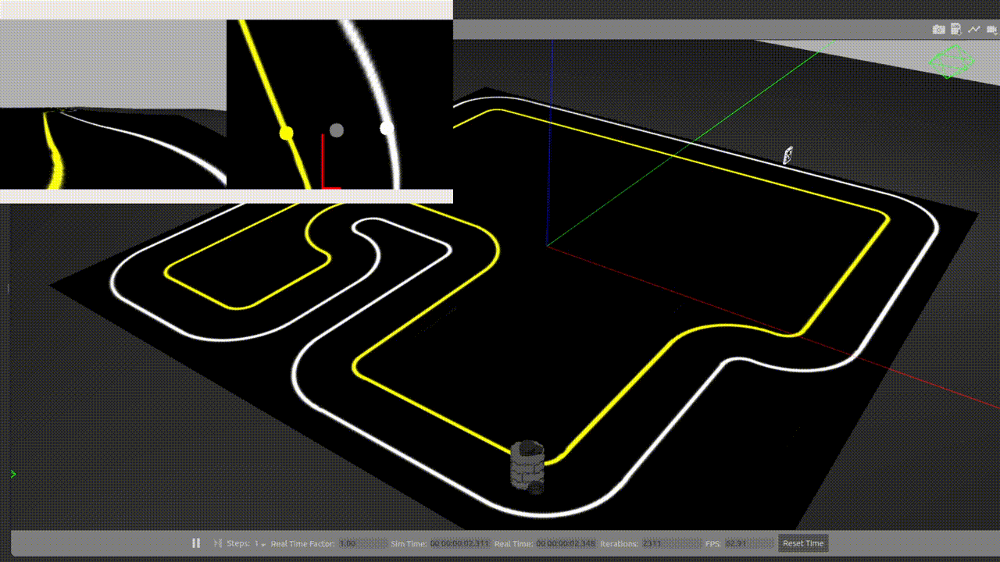
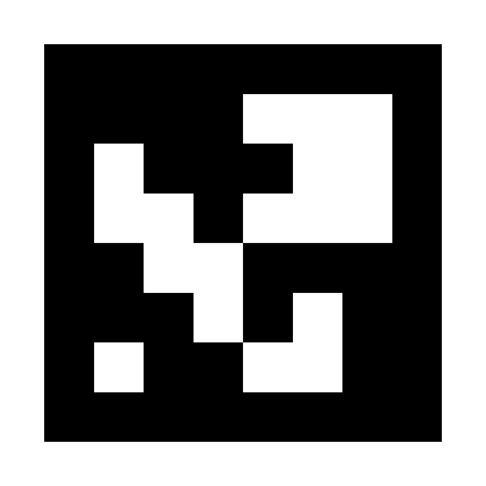

# Racetrack Lane Following Control
Autonomous driving on Turtlebot3 with bird's-eye-view and ArUco pose estimation.

**Racing Demo**




**ArUco Marker as the Stop Sign**



Notes: a *PID controller* and a *nonholomonic mobile feedback controller* are implemented in the `controllers.py`, and a *Neumaier's moving window filter* is implemented in the `moving_window_filter.py`. 

## Quick Start

1. Clone and add this package to your catkin workspace
    ```
    cd ~/catkin_ws/src
    git clone git@github.com:silvery107/racetrack-lane-following-control.git
    cd ..
    catkin_make
    ```

2. Export models and launch the racetrack in gazebo
    ```   
    cd src/racetrack-lane-following-control/
    export GAZEBO_MODEL_PATH=${GAZEBO_MODEL_PATH}:./models
    roslaunch racetrack_lane_following race_track.launch
    ```

3. Add the execute permission for python nodes in the `scripts` folder

    ```
    chmod +x lane_following_part1.py
    chmod +x lane_following_part2.py
    chmod +x lane_following_part3.py
    ```

## Part I: Driving in the racetrack

```
rosrun racetrack_lane_following lane_following_part1.py
```

## Part II: Driving with Bird's Eye View

```
rosrun racetrack_lane_following lane_following_part2.py
```

## Part III: Stop Sign with ArUco Marker

```
rosrun racetrack_lane_following lane_following_part3.py
```

